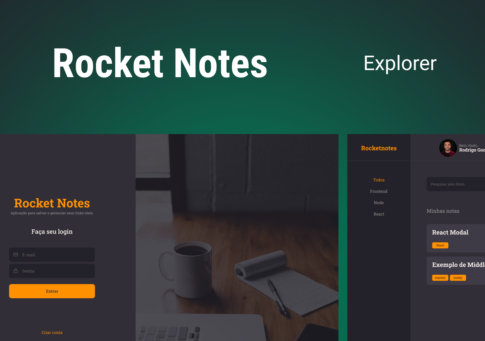

<h1>RocketNotes</h1>

 

<h2> O Projeto </h2>

O projeto foi desenvolvido como desafio do curso Explorer da Rocketseat. 
 

Back-end da aplicação RocketNotes. API completa utilizando Node.js e Express. Foi Criado um banco de dados utilizando SQLite, manipulação do banco utilizando a ferramenta Beekeper Studio juntamente com o Query Builder Knex.js. 

Foi implantado: autenticação de usuários e upload de imagens. Além das funcionalidades para que a integração entre o front-end e back-end funcione corretamente.

  

 

  

 

Quer conferir o RocketNotes? 

[Visite o projeto online](https://notasrocket.netlify.app/)

 

<h2> O intuito do projeto </h2>

O intuito do projeto foi colocar em prática os conhecimentos acerca de:

- HTML
- CSS
- JavaScript
- NodeJS
  - bcryptjs
  - Cors
  - Express
  - JSONwebtoken
  - Knex
  - multer
  - SQlite
  - JWT;
  - Middlewares
  - API Restful
  - PM2
  - Deploy e utilização do render
  - Variáveis de ambiente
  - Testes automatizados
  - Jest

 

<h2> Tecnologias </h2>

Foi utilizado as seguintes tecnologias para desenvolver esse projeto:

- HTML
- CSS
- JavaScript
- NodeJS
- Git
- GitHub